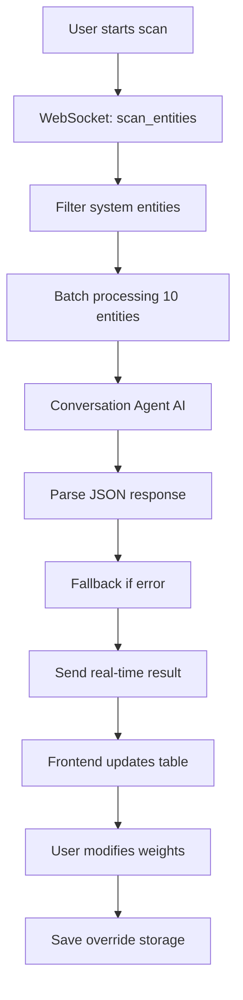

# HASS AI - Developer Guide

## 📁 Project Structure

```
hass_ai/
├── custom_components/hass_ai/
│   ├── __init__.py              # Main entry point
│   ├── config_flow.py           # UI Configuration 
│   ├── const.py                 # Constants
│   ├── intelligence.py          # AI logic for entity analysis
│   ├── services.py              # Exposed services
│   ├── exceptions.py            # Custom exceptions
│   ├── manifest.json            # Integration metadata
│   ├── services.yaml            # Services UI definition
│   ├── translations/
│   │   ├── en.json              # English translations
│   │   └── it.json              # Italian translations
│   └── www/
│       └── panel.js             # Frontend panel
├── README.md
├── FEATURES.md
├── REQUIREMENTS.md
├── hacs.json                    # HACS configuration
└── test_config.py               # Configuration tests
```

## 🧩 Component Architecture

### 1. **__init__.py** - Entry Point
- Frontend panel registration
- WebSocket API setup  
- Persistent storage configuration
- Services registration
- Integration lifecycle management

### 2. **intelligence.py** - AI Engine
- Entity batch analysis (configurable batch size)
- Conversation agent integration 
- Domain-based fallback
- Robust error handling
- Importance classification 0-5

### 3. **config_flow.py** - Configuration
- Initial configuration flow
- Advanced options management
- User input validation
- Multiple AI provider support

### 4. **services.py** - Public API
- `scan_entities`: Automatic scanning
- `get_entity_importance`: Single entity analysis  
- `reset_overrides`: Configuration reset
- Rigorous schema validation

### 5. **www/panel.js** - Frontend
- Reactive user interface
- Real-time WebSocket communication
- Interactive override controls
- Multilingual support (IT/EN)
- Material Design components

## 🔧 Data Flow



## 🎯 AI Evaluation Logic

### Prompt Template
```
"As a Home Assistant expert, analyze these {N} entities and rate their automation importance on a scale of 0-5:
0 = Ignore (diagnostic/unnecessary)
1 = Very Low (rarely useful)  
2 = Low (occasionally useful)
3 = Medium (commonly useful)
4 = High (frequently important)
5 = Critical (essential for automations)

Consider: device type, location relevance, automation potential, security importance.
Respond in strict JSON format as an array of objects with 'entity_id', 'rating', and 'reason'."
```

### Domain Mapping (Fallback)
```python
ENTITY_IMPORTANCE_MAP = {
    "alarm_control_panel": 5,  # Critical security
    "lock": 5,                 # Critical security  
    "climate": 4,              # Important HVAC
    "camera": 4,               # Important monitoring
    "device_tracker": 3,       # Useful presence
    "light": 3,                # Common lighting
    "switch": 3,               # Common controls
    "sensor": 2,               # Occasional data
    "media_player": 2,         # Optional entertainment
    "sun": 1,                  # Rarely used
}
```

## 📡 WebSocket API

### Available Commands

#### 1. Load Overrides
```javascript
{
  "type": "hass_ai/load_overrides"
}
// Response: {"overrides": {...}}
```

#### 2. Entity Scanning  
```javascript
{
  "type": "hass_ai/scan_entities"
}
// Real-time events:
// {"type": "entity_result", "result": {...}}
// {"type": "scan_complete"}
```

#### 3. Save Overrides
```javascript
{
  "type": "hass_ai/save_overrides",
  "overrides": {
    "light.living_room": {
      "enabled": true,
      "overall_weight": 5
    }
  }
}
```

## 🔧 Home Assistant Services

### hass_ai.scan_entities
```yaml
service: hass_ai.scan_entities
data:
  entity_filter: "sensor."    # Optional
  batch_size: 10             # 1-50, default 10
```

### hass_ai.get_entity_importance  
```yaml
service: hass_ai.get_entity_importance
data:
  entity_id: "light.kitchen"
```

### hass_ai.reset_overrides
```yaml
service: hass_ai.reset_overrides  
data:
  confirm: true              # Required
```

## 🗃️ Storage Format

File: `.storage/hass_ai_intelligence_data`
```json
{
  "version": 1,
  "data": {
    "light.living_room": {
      "enabled": true,
      "overall_weight": 5  
    },
    "sensor.temperature": {
      "enabled": false
    }
  }
}
```

## 🚀 Deployment and Testing

### Development Installation
```bash
# Copy files
cp -r custom_components/hass_ai /config/custom_components/

# Restart HA  
service homeassistant restart

# Check logs
tail -f /config/home-assistant.log | grep hass_ai
```

### Manual Testing
1. Add integration via UI
2. Configure conversation agent (Gemini/OpenAI)
3. Open HASS AI panel
4. Start test scan
5. Verify results and overrides
6. Test services from Developer Tools

### Common Debug
```python
# Enable debug logging
logger:
  logs:
    custom_components.hass_ai: debug
```

## 🔮 Development Roadmap

### Current Version (1.4.0)
- ✅ AI batch analysis  
- ✅ Interactive UI panel
- ✅ Persistent storage
- ✅ Services API
- ✅ Multilingual support

### Future Versions  
- 🔄 Multiple AI providers (OpenAI, Gemini direct)
- 🔄 Entity attribute analysis
- 🔄 Local machine learning
- 🔄 Statistics dashboard
- 🔄 Import/export configurations
- 🔄 Extended REST API

## 🐛 Troubleshooting

### Common Errors

1. **"AI response is not valid JSON"**
   - Conversation agent not configured
   - AI provider overloaded
   - Prompt too long

2. **"No conversation agent found"**  
   - Install AI integration (Google Generative AI, OpenAI)
   - Configure API key correctly

3. **"Frontend panel not loading"**
   - Check panel.js file 
   - Check browser console for errors
   - Clear browser cache

4. **"Services not available"**
   - Restart Home Assistant
   - Check YAML configuration
   - Check permissions

### Useful Logs
```python
_LOGGER.debug(f"Processing batch {batch_num}/{total_batches}")
_LOGGER.info(f"Scan completed: {len(results)} entities")  
_LOGGER.error(f"AI analysis failed: {error}")
```

This component is designed to be robust, extensible, and easy to maintain following Home Assistant best practices.
