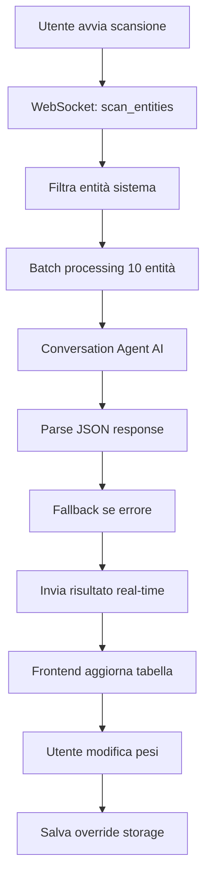

# HASS AI - Guida Sviluppatore

## 📁 Struttura del Progetto

```
hass_ai/
├── custom_components/hass_ai/
│   ├── __init__.py              # Entry point principale
│   ├── config_flow.py           # Configurazione UI 
│   ├── const.py                 # Costanti
│   ├── intelligence.py          # Logica AI per analisi entità
│   ├── services.py              # Servizi esposti
│   ├── exceptions.py            # Eccezioni custom
│   ├── manifest.json            # Metadati integrazione
│   ├── services.yaml            # Definizione servizi UI
│   ├── translations/
│   │   ├── en.json              # Traduzioni inglese
│   │   └── it.json              # Traduzioni italiano
│   └── www/
│       └── panel.js             # Frontend pannello
├── README.md
├── FEATURES.md
├── REQUIREMENTS.md
├── hacs.json                    # Configurazione HACS
└── test_config.py               # Test di configurazione
```

## 🧩 Architettura Componenti

### 1. **__init__.py** - Entry Point
- Registrazione pannello frontend
- Setup WebSocket API  
- Configurazione storage persistente
- Registrazione servizi
- Gestione ciclo di vita integrazione

### 2. **intelligence.py** - Motore AI
- Analisi batch delle entità (configurable batch size)
- Integrazione con conversation agent 
- Fallback basato su domini
- Gestione errori robuста
- Classificazione importanza 0-5

### 3. **config_flow.py** - Configurazione
- Flow di configurazione iniziale
- Gestione opzioni avanzate
- Validazione input utente
- Support per AI provider multipli

### 4. **services.py** - API Pubblica
- `scan_entities`: Scansione automatica
- `get_entity_importance`: Analisi singola entità  
- `reset_overrides`: Reset configurazione
- Validazione schema rigorosa

### 5. **www/panel.js** - Frontend
- Interfaccia utente reattiva
- Comunicazione WebSocket real-time
- Controlli interattivi per override
- Supporto multilingua (IT/EN)
- Material Design components

## 🔧 Flusso di Dati



## 🎯 Logica di Valutazione AI

### Prompt Template
```
"As a Home Assistant expert, analyze these {N} entities and rate their automation importance on a scale of 0-5:
0 = Ignore (diagnostic/unnecessary)
1 = Very Low (rarely useful)  
2 = Low (occasionally useful)
3 = Medium (commonly useful)
4 = High (frequently important)
5 = Critical (essential for automations)

Consider: device type, location relevance, automation potential, security importance.
Respond in strict JSON format as an array of objects with 'entity_id', 'rating', and 'reason'."
```

### Mappatura Domini (Fallback)
```python
ENTITY_IMPORTANCE_MAP = {
    "alarm_control_panel": 5,  # Sicurezza critica
    "lock": 5,                 # Sicurezza critica  
    "climate": 4,              # HVAC importante
    "camera": 4,               # Monitoring importante
    "device_tracker": 3,       # Presenza utile
    "light": 3,                # Illuminazione comune
    "switch": 3,               # Controlli comuni
    "sensor": 2,               # Dati occasionali
    "media_player": 2,         # Entertainment opzionale
    "sun": 1,                  # Raramente usato
}
```

## 📡 API WebSocket

### Comandi Disponibili

#### 1. Carica Override
```javascript
{
  "type": "hass_ai/load_overrides"
}
// Response: {"overrides": {...}}
```

#### 2. Scansione Entità  
```javascript
{
  "type": "hass_ai/scan_entities"
}
// Real-time events:
// {"type": "entity_result", "result": {...}}
// {"type": "scan_complete"}
```

#### 3. Salva Override
```javascript
{
  "type": "hass_ai/save_overrides",
  "overrides": {
    "light.living_room": {
      "enabled": true,
      "overall_weight": 5
    }
  }
}
```

## 🔧 Servizi Home Assistant

### hass_ai.scan_entities
```yaml
service: hass_ai.scan_entities
data:
  entity_filter: "sensor."    # Opzionale
  batch_size: 10             # 1-50, default 10
```

### hass_ai.get_entity_importance  
```yaml
service: hass_ai.get_entity_importance
data:
  entity_id: "light.kitchen"
```

### hass_ai.reset_overrides
```yaml
service: hass_ai.reset_overrides  
data:
  confirm: true              # Obbligatorio
```

## 🗃️ Formato Storage

File: `.storage/hass_ai_intelligence_data`
```json
{
  "version": 1,
  "data": {
    "light.living_room": {
      "enabled": true,
      "overall_weight": 5  
    },
    "sensor.temperature": {
      "enabled": false
    }
  }
}
```

## 🚀 Deployment e Testing

### Installazione Dev
```bash
# Copia files
cp -r custom_components/hass_ai /config/custom_components/

# Riavvia HA  
service homeassistant restart

# Verifica logs
tail -f /config/home-assistant.log | grep hass_ai
```

### Test Manuali
1. Aggiungi integrazione via UI
2. Configura conversation agent (Gemini/OpenAI)
3. Apri pannello HASS AI
4. Avvia scansione test
5. Verifica risultati e override
6. Test servizi da Developer Tools

### Debug Comune
```python
# Abilita debug logging
logger:
  logs:
    custom_components.hass_ai: debug
```

## 🔮 Roadmap Sviluppo

### Versione Corrente (1.3.0)
- ✅ Analisi AI batch  
- ✅ UI panel interattivo
- ✅ Storage persistente
- ✅ Servizi API
- ✅ Supporto multilingua

### Prossime Versioni  
- 🔄 AI provider multipli (OpenAI, Gemini direct)
- 🔄 Analisi attributi entità
- 🔄 Machine learning locale
- 🔄 Dashboard statistiche
- 🔄 Import/export configurazioni
- 🔄 API REST estesa

## 🐛 Troubleshooting

### Errori Comuni

1. **"AI response is not valid JSON"**
   - Conversation agent non configurato
   - Provider AI overloaded
   - Prompt troppo lungo

2. **"No conversation agent found"**  
   - Installa integrazione AI (Google Generative AI, OpenAI)
   - Configura API key correttamente

3. **"Frontend panel non carica"**
   - Verifica file panel.js 
   - Controlla console browser per errori
   - Cache browser da svuotare

4. **"Servizi non disponibili"**
   - Riavvia Home Assistant
   - Verifica configurazione YAML
   - Controlla permissions

### Log Utili
```python
_LOGGER.debug(f"Processing batch {batch_num}/{total_batches}")
_LOGGER.info(f"Scan completed: {len(results)} entities")  
_LOGGER.error(f"AI analysis failed: {error}")
```

Questo componente è progettato per essere robusto, espandibile e facile da mantenere seguendo le best practice di Home Assistant.
